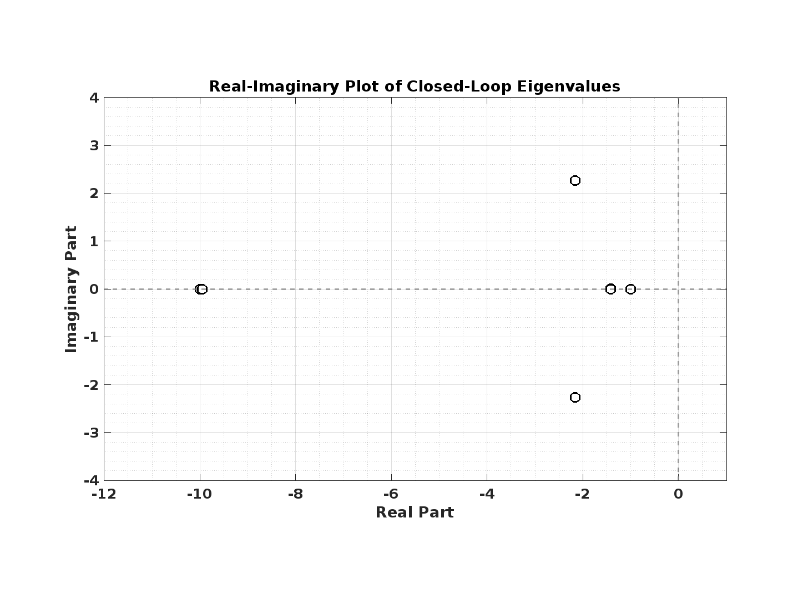
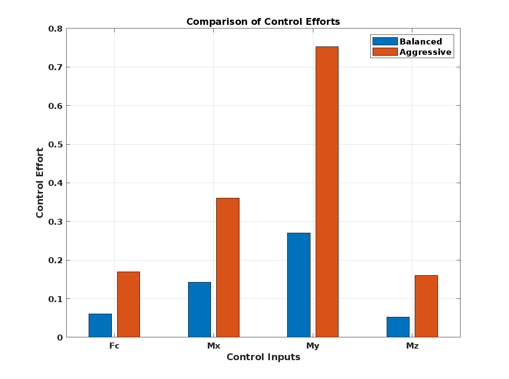
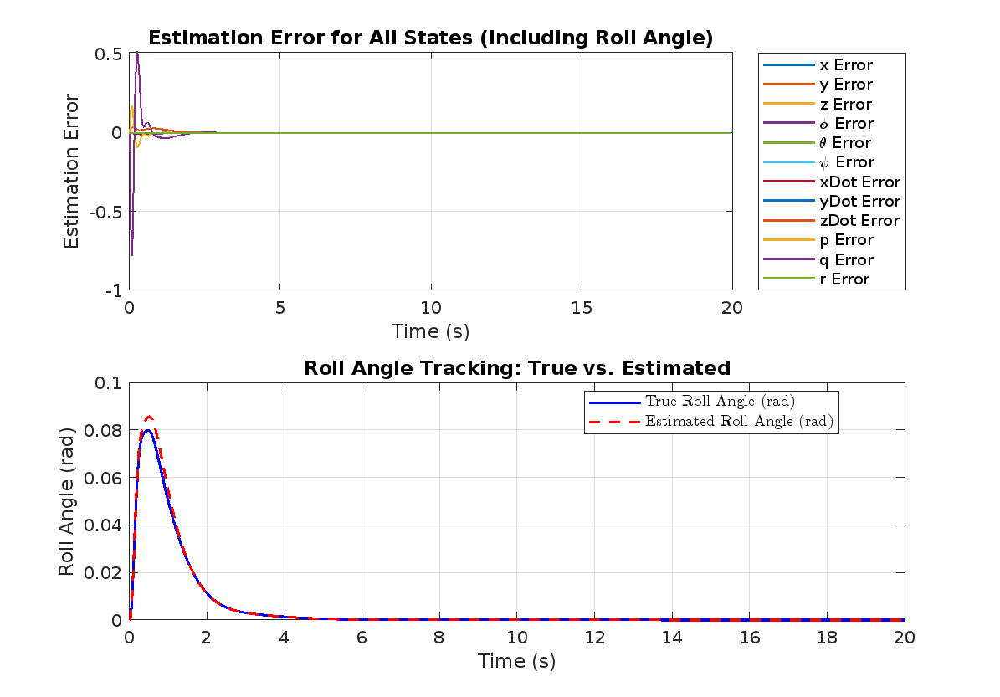
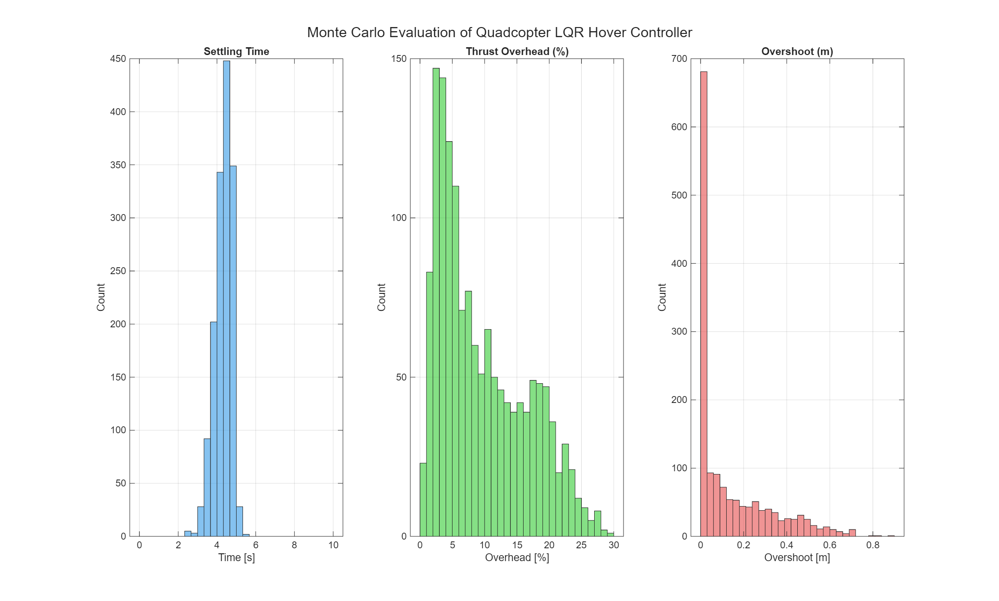

# Hover Stabilizing Drone

## Overview

I apply principles taught in ENME605 Advanced Systems Control to design and simulate a full-state feedback control system for hover control of a quadcopter drone. I begin by deriving a state-space model, linearizing the equations of motion about the hover state, and verifying controllability. Using the Linear Quadratic Regulator (LQR) optimal control framework, I design the quadcopter's hover controller and improve upon it by refining the LQR weighting matrices. I then confirm observability and design an observer via pole placement to reconstruct unmeasured states. My focus with this project is on applying state-space modeling, LQR, and state estimation techniques. 

## Deriving the Plant Dynamics
I derive the state-space model for the quadcopter drone. I define the physical parameters of the drone, I define the quadcopter's degrees of freedom, I define a suitable state vector, I define the quadcopter's control inputs, I derive the equations of motion, I linearize the equations of motion about the hover condition, and I cast the linearized equations of motion into a state-space form suitable for linear control design. 

## Defining the Quadcopter's Physical parameters
I define the quadcopter's physical parameters. I represent the quadcopter as a rigid body that has both rotational symmetry and line symmetry. Viewed from above, the quadcopter is X-shaped, having $90^\circ$ rotational symmetry about its $z$-axis and line symmetry across its $x$ and $y$ axes. Its inertia tensor is a diagonal matrix. The force of gravity acts on the quadcopter at all times. These mass properties are consistent with those of consumer-grade micro-UAVs. 

### Table: Dynamics Model Physical Parameters

| **Physical Parameter**                   | **Symbol** | **Value**          |
|------------------------------------------|-----------|--------------------|
| Total mass                               | *m*       | 0.5 kg             |
| Gravitational acceleration               | *g*       | 9.81 m/s²          |
| Body X-Axis Moment of Inertia            | *Iz*      | 0.02 kg·m²         |
| Body Y-Axis Moment of Inertia            | *Iy*      | 0.02 kg·m²         |
| Body Z-Axis Moment of Inertia            | *Iz*      | 0.04 kg·m²         |


## Defining the Quadcopter's Degrees of Freedom
I define the quadcopter's degrees of freedom. The quadcopter has six degrees of freedom, three translational and three rotational. I employ Euler angles to represent the three rotational degrees of freedom. The particular Euler angle sequence I employ for these derivations is the Z-Y-X Euler angle sequence. 

### Table: Quadcopter Degrees of Freedom

| **Category**       | **Property**             | **Symbol** |
|--------------------|--------------------------|------------|
| Linear Position    | X-coordinate            | x          |
|                    | Y-coordinate            | y          |
|                    | Z-coordinate            | z          |
| Orientation        | Roll (about X-axis)     | φ (phi)    |
|                    | Pitch (about Y-axis)    | θ (theta)  |
|                    | Yaw (about Z-axis)      | ψ (psi)    |

## Defining the Quadcopter's State Variables
I define the quadcopter's state variables. There are three state variables for linear position, three state variables for 3D orientation, three state variables for linear velocity, and three state variables for angular velocity. All state variables corresponding to linear position and linear velocity are world-frame coordinates. The angular displacement state variables are the Z-Y-X Euler angles. The angular velocity state variables are measured in the body frame. 

$$
\mathbf{x} =
\begin{bmatrix}
x & y & z & \phi & \theta & \psi & \dot{x} & \dot{y} & \dot{z} & p & q & r
\end{bmatrix}^\top
$$

## Defining the Quadcopter's Control inputs
I define the quadcopter's control inputs. There are four control inputs. The first is the total thrust force produced by the quadcopter. This force is always directed in the positive z-direction of the body frame. The second, third, and fourth control input are the roll moment, the pitch moment, and the yaw moment, in that order. 

$$
\begin{equation}
\mathbf{u} =
\begin{bmatrix}
F_c & M_x & M_y & M_z 
\end{bmatrix}^\top
\end{equation}
$$

## Deriving the Quadcopter's Equations of Motion
I derive the quadcopter's nonlinear equations of motion. To do so, I employ the Newton-Euler equations from classical mechanics. The result is a nonlinear system of second-order differential equations that will serve the purpose of simulating the quadcopter's true dynamics, that is, how the quadcopter moves in response to control inputs.


$$
  \begin{aligned}
    \ddot{x} &= \frac{F_c (\sin(\phi) \sin(\psi) + \cos(\phi) \cos(\psi) \sin(\theta))}{m}, \\
    \ddot{y} &= -\frac{F_c (\cos(\psi) \sin(\phi) - \cos(\phi) \sin(\psi) \sin(\theta))}{m}, \\
    \ddot{z} &= \frac{F_c \cos(\phi) \cos(\theta)}{m} - g, \\
    \dot{p} &= \frac{M_x}{I_x} - \frac{(I_z - I_y) r q}{I_x}, \\
    \dot{q} &= \frac{M_y}{I_y} - \frac{(I_x - I_z) p r}{I_y}, \\
    \dot{r} &= \frac{M_z}{I_z} - \frac{(I_y - I_x) q p}{I_z}.
  \end{aligned}
  $$

  ## Linearizing the Equations of Motion about the Hover State
  I linearize the equations of motion about the hover state. Since the quadcopter represents a nonlinear system and since LQR control requires a linear dynamics model of the plant rather than a nonlinear model, linearization is necessary. Since my control objective is hover stabilization, I linearize the dynamics about the hover state operating point. At the hover point, the quadcopter's state is effectively "zeroed", representative of having straight and level orientation, not translating, not rotating, and not accelerating angularly or linearly. It's weight is exactly balanced by the collective thrust force it generates.

$$
\mathbf{x}_0 =
\begin{bmatrix}
0 & 0 & 0 & 0 & 0 & 0 & 0 & 0 & 0 & 0 & 0 & 0
\end{bmatrix}^\top, \quad
\mathbf{u}_0 =
\begin{bmatrix}
mg & 0 & 0 & 0
\end{bmatrix}^\top
$$

## Casting the Equations of Motion into State-Space Form 
I cast the equations of motion into state-space form. This is the first step of my linearization process and effectively reformulates the system of second-order differential equations into an equivalent system of first-order differential equations, referred to as state equations. The system of state equations can be represented by a single vector-valued function dependent on only the states and inputs.

$$    
\dot{\mathbf{x}} = \mathbf{f}(\mathbf{x}, \mathbf{u})
$$

The following are the explicitly stated state equations for the quadcopter.

$$
\begin{equation}
    \begin{aligned}
        \dot{x} &= \dot{x}, \\
        \dot{y} &= \dot{y}, \\
        \dot{z} &= \dot{z}, \\
        \dot{\phi} &= p + r \cos(\phi) \tan(\theta) + q \sin(\phi) \tan(\theta), \\
        \dot{\theta} &= q \cos(\phi) - r \sin(\phi), \\
        \dot{\psi} &= \frac{r \cos(\phi)}{\cos(\theta)} + \frac{q \sin(\phi)}{\cos(\theta)}, \\
        \ddot{x} &= \frac{F_c}{m} (\sin(\phi)\sin(\psi) + \cos(\phi)\cos(\psi)\sin(\theta)), \\
        \ddot{y} &= -\frac{F_c}{m} (\cos(\psi)\sin(\phi) - \cos(\phi)\sin(\psi)\sin(\theta)), \\
        \ddot{z} &= \frac{F_c \cos(\phi) \cos(\theta)}{m} - g, \\
        \dot{p} &= \frac{M_x}{I_x} + \frac{q r (I_y - I_z)}{I_x}, \\
        \dot{q} &= \frac{M_y}{I_y} - \frac{p r (I_x - I_z)}{I_y}, \\
        \dot{r} &= \frac{M_z}{I_z} + \frac{p q (I_x - I_y)}{I_z}.
    \end{aligned}
\end{equation}
$$

## Applying the Linear Approximation at the Hover State
I apply the notion of first-order Taylor series linear approximation to linearize the dynamics about the hover state. This process involves computing the Jacobian matrix of the state equations with respect to the states, computing the Jacobian matrix with respect to the input variables, evaluating both Jacobian matrices at the hover state, and combining them with the state and input vectors. The resulting linear model is valid for states near the hover state.

$$
\begin{equation}
    \dot{\mathbf{x}} = \left. \frac{\partial \mathbf{f}}{\partial \mathbf{x}} \right|_{\mathbf{x}_0, \mathbf{u}_0} \mathbf{x} + 
                       \left. \frac{\partial \mathbf{f}}{\partial \mathbf{u}} \right|_{\mathbf{x}_0, \mathbf{u}_0} \mathbf{u} = 
                       \mathbf{A} \mathbf{x} + \mathbf{B} \mathbf{u}.
\end{equation}
$$


Furthermore, the resulting state-space model is linear time-invariant, therefore well suited for LQR controller design. The system's $\mathbf{A}$ and $\mathbf{B}$ are the following.

$$
\begin{equation}
\begin{aligned}
   \mathbf{A} &= \begin{bmatrix}
       0 & 0 & 0 & 0 & 0 & 0 & 1 & 0 & 0 & 0 & 0 & 0 \\
       0 & 0 & 0 & 0 & 0 & 0 & 0 & 1 & 0 & 0 & 0 & 0 \\
       0 & 0 & 0 & 0 & 0 & 0 & 0 & 0 & 1 & 0 & 0 & 0 \\
       0 & 0 & 0 & 0 & 0 & 0 & 0 & 0 & 0 & 1 & 0 & 0 \\
       0 & 0 & 0 & 0 & 0 & 0 & 0 & 0 & 0 & 0 & 1 & 0 \\
       0 & 0 & 0 & 0 & 0 & 0 & 0 & 0 & 0 & 0 & 0 & 1 \\
       0 & 0 & 0 & 0 & g & 0 & 0 & 0 & 0 & 0 & 0 & 0 \\
       0 & 0 & 0 & -g & 0 & 0 & 0 & 0 & 0 & 0 & 0 & 0 \\
       0 & 0 & 0 & 0 & 0 & 0 & 0 & 0 & 0 & 0 & 0 & 0 \\
       0 & 0 & 0 & 0 & 0 & 0 & 0 & 0 & 0 & 0 & 0 & 0 \\
       0 & 0 & 0 & 0 & 0 & 0 & 0 & 0 & 0 & 0 & 0 & 0 \\
       0 & 0 & 0 & 0 & 0 & 0 & 0 & 0 & 0 & 0 & 0 & 0 
   \end{bmatrix}, \\
   \mathbf{B} &= \begin{bmatrix}
         0 & 0 & 0 & 0 \\
         0 & 0 & 0 & 0 \\
         0 & 0 & 0 & 0 \\
         0 & 0 & 0 & 0 \\
         0 & 0 & 0 & 0 \\
         0 & 0 & 0 & 0 \\
         0 & 0 & 0 & 0 \\
         0 & 0 & 0 & 0 \\
       \frac{1}{m} & 0 & 0 & 0 \\
         0 & \frac{1}{I_x} & 0 & 0 \\
         0 & 0 & \frac{1}{I_y} & 0 \\
         0 & 0 & 0 & \frac{1}{I_z}
   \end{bmatrix}
\end{aligned}
\end{equation}
$$

## Verifying controllability
I verify that the plant is controllable. A system is controllable when the control inputs are capable of driving the system, within finite time, from any initial state in the state space to any final state in the state space. For LTI systems, a sufficient condition for controllability is that the rank of the controllability test matrix, $\mathbf{N}$, equals the dimension of the state space, $k$. 

$$
\begin{equation}
    \mathbf{N} = \begin{bmatrix} \mathbf{B} & \mathbf{A}\mathbf{B} & \mathbf{A}^2\mathbf{B} & \cdots & \mathbf{A}^{k-1}\mathbf{B} \end{bmatrix}.
\end{equation}
$$

The quadcopter system has 12 state variables, so $k$ is 12. With MATLAB, I assemble the controllability test matrix and verify $rank(\mathbf{N}) = k$, confirming that the quadcopter is controllable. 

# Designing the Controller
I design a full-state feedback controller for quadcopter hover stabilization by deriving the closed-loop dynamics and using the LQR framework to compute a suitable feedback gain matrix.

## Deriving the Closed-Loop Dynamics
In feedback control, the generated control signal is applied as an input to the plant dynamics. In full-state feedback control, the feedback controller operates on the error between the estimated state and the reference signal. In this case, the case of hover stabilization, the reference signal is the zero vector. The controller is a matrix multiplier, premultiplying a constant gain matrix $\mathbf{K}$ by the state vector.

$$
\begin{equation}
  \mathbf{u} = - \mathbf{K} \mathbf{x}
\end{equation}
$$

A mathematical model of the entire control loop can thus be derived by directly substituting the control law into the plant's state-space representation. The resulting model is referred to as the closed-loop system dynamics. The derivation proceeds as follows: 


$$
\begin{equation}
    \dot{\mathbf{x}} = \mathbf{A}\mathbf{x} + \mathbf{B}\mathbf{u}
\end{equation}
$$

$$
\begin{equation}
    \dot{\mathbf{x}} = \mathbf{A}\mathbf{x} + \mathbf{B}(-\mathbf{K}\mathbf{x})
\end{equation}
$$

$$
\begin{equation}
    \dot{\mathbf{x}} = \mathbf{A}\mathbf{x} - \mathbf{B}\mathbf{K}\mathbf{x}
\end{equation}
$$

$$
\begin{equation}
    \dot{\mathbf{x}} = (\mathbf{A} - \mathbf{B}\mathbf{K})\mathbf{x}
\end{equation}
$$

This closed-loop system dynamics model reveals that the stability of the system depends on the eigenvalues of the matrix $\mathbf{A}-\mathbf{B}\mathbf{K}$. If all eigenvalues have strictly negative real parts, the system is asymptotically stable. For hover control of a quadcopter, this ensures that any deviations from the equilibrium hover state—such as changes in position, orientation, or velocity—will decay to zero over time, allowing the quadcopter to maintain stability in the presence of small disturbances.

It therefore follows that the feedback gain matrix must be designed to ensure that all eigenvalues of $\mathbf{A}-\mathbf{B}\mathbf{K}$ have strictly negative real parts. 

## Solving for the Control Gains
To design the full-state feedback controller, I compute the optimal gain matrix $\mathbf{K}$ using the Linear Quadratic Regulator (LQR) method. The LQR framework minimizes a cost function that balances state deviation and control effort:

$$
\begin{equation}
    J = \int_0^\infty \left( \mathbf{x}^\top \mathbf{Q} \mathbf{x} + \mathbf{u}^\top \mathbf{R} \mathbf{u} \right) \, dt,
\end{equation}
$$

where $\mathbf{Q}$ is a symmetric positive semidefinite matrix that penalizes deviations from the desired state, and $\mathbf{R}$ is a symmetric positive definite matrix that penalizes excessive control effort. To solve for $\mathbf{K}$, I first compute the solution $\mathbf{P}$ to the Algebraic Riccati Equation (ARE):

$$
\begin{equation}
    \mathbf{A}^\top \mathbf{P} + \mathbf{P}\mathbf{A} - \mathbf{P}\mathbf{B}\mathbf{R}^{-1}\mathbf{B}^\top \mathbf{P} + \mathbf{Q} = 0.
\end{equation}
$$

Once I compute $\mathbf{P}$, I derive the optimal gain matrix $\mathbf{K}$ using the equation:

$$
\begin{equation}
    \mathbf{K} = \mathbf{R}^{-1}\mathbf{B}^\top \mathbf{P}.
\end{equation}
$$

I implement this process in MATLAB, where I use numerical solvers to compute $\mathbf{P}$ and subsequently calculate $\mathbf{K}$. After obtaining $\mathbf{K}$, I verify its correctness by ensuring that the eigenvalues of the closed-loop system matrix $\mathbf{A} - \mathbf{B}\mathbf{K}$ have strictly negative real parts. Figure~\ref{fig:enter-label} illustrates the real-imaginary plot of these eigenvalues, confirming that the feedback system effectively stabilizes the quadcopter to the hover state.




**Figure:** The Real-Imaginary Plot of the Closed-Loop Eigenvalues when **Q** = **I**₁₂ₓ₁₂ and **R** = **I**₄ₓ₄


I implement this process in MATLAB, where I use numerical solvers to compute $\mathbf{P}$ and subsequently calculate $\mathbf{K}$. After obtaining $\mathbf{K}$, I verify its correctness by ensuring that the eigenvalues of the closed-loop system matrix $\mathbf{A} - \mathbf{B}\mathbf{K}$ have strictly negative real parts. Figure~\ref{fig:enter-label} illustrates the real-imaginary plot of these eigenvalues, confirming that the feedback system effectively stabilizes the quadcopter to the hover state.


**Figure:** The Real-Imaginary Plot of the Closed-Loop Eigenvalues when **Q** = **I₁₂ₓ₁₂** and **R** = **I₄ₓ₄**


## Verifying Expected Results
I verify expected results by examining the settling time required for all quadcopter states to return to equilibrium following a small initial perturbation from hover. To achieve this, I adjust the weighting matrices in the LQR cost function, changing the balance between penalizing state deviation and penalizing control effort.

Initially, I set $\mathbf{R} = \mathbf{I}$, which applies an equal penalty to all control inputs. Under these conditions, and with an initial perturbation of $-0.025$ applied to all states, I simulate the closed-loop system and measure a settling time of approximately 1.91 seconds. To achieve faster stabilization, I reduce the penalty on control effort by choosing $\mathbf{R} = 0.1\mathbf{I}$, allowing the controller to respond more aggressively to deviations.

With this adjustment, the system settles more quickly, requiring approximately 1.74 seconds to return to equilibrium. Figure 2 compares the control inputs for both configurations, showing that the more aggressive controller (with $\mathbf{R} = 0.1\mathbf{I}$) applies greater control effort. Additionally, 3 compares the closed-loop eigenvalues for the two configurations, revealing that the reduced control penalty shifts the eigenvalues further to the left in the complex plane, indicating that the closed-loop system returns to equilibrium more rapidly.



**Figure 2.** Control Inputs for the Balanced (**R** = **I**) and More Aggressive (**R** = 0.1**I**) Configurations.


**Figure 3.** Closed-Loop Eigenvalues for the Balanced (**R** = **I**) and More Aggressive (**R** = 0.1**I**) Controllers.


For this project, I select the more aggressive controller for its reduced settling time. However, I acknowledge that in practice, factors such as actuator saturation, component constraints, and energy usage must be carefully considered to ensure the chosen parameters are appropriate for the physical system.


## Designing the Observer 
I design a state estimator for the quadcopter system. The observer reconstructs the full state vector from available output measurements, even when some states are not directly measurable. To achieve this, I derive the observer error dynamics, verify the system’s observability, solve for the observer gains, and verify the expected behavior of the observer.

### Verifying Observability
 I verify that the quadcopter system is observable. Observability is the property that determines whether the observer can reconstruct the entire state vector from the available outputs and known inputs over time. For LTI systems, a sufficient condition for observability is that the rank of the observability matrix, $\mathbf{O}$
 , equals the dimension of the state space, $k$
 . I write the observability matrix as 
 
 $$
 \begin{equation} \mathbf{O} = \begin{bmatrix} \mathbf{C}^\top & (\mathbf{C}\mathbf{A})^\top & (\mathbf{C}\mathbf{A}^2)^\top & \cdots & (\mathbf{C}\mathbf{A}^{k-1})^\top \end{bmatrix}^\top.  \end{equation}
$$

I test observability using three variations of the output matrix. First, I assume that all states are measured, so $\mathbf{C}$ is the $12 \times 12$ identity matrix. Next, I consider a partial measurement scenario by constructing $\mathbf{C}'$, which is identical to $\mathbf{C}$ except that it omits the row corresponding to the roll angle measurement. Finally, I construct $\mathbf{C}''$ by further omitting the row corresponding to the pitch angle measurement. In all three cases, I use MATLAB to form $\mathbf{O}$ and verify that its rank equals 12. This confirms that the quadcopter system remains observable even when some states are not directly measured. 


### Deriving the Observer's Error Dynamics
 I derive the error dynamics for the observer. The observer estimates the state vector, $\hat{\mathbf{x}}$, using the system outputs and control inputs. The general form of the observer is given by 
 
 $$
 \begin{equation} \dot{\hat{\mathbf{x}}} = \mathbf{A}\hat{\mathbf{x}} + \mathbf{B}\mathbf{u} + \mathbf{L}(\mathbf{y} - \mathbf{C}\hat{\mathbf{x}}), \end{equation}
 $$

 where $\mathbf{L}$ is the observer gain matrix, $\mathbf{y}$ is the measured output vector, and $\mathbf{C}$ is the output matrix. The term $\mathbf{L}(\mathbf{y} - \mathbf{C}\hat{\mathbf{x}})$ adjusts the observer’s estimate to reduce the difference between the measured and estimated outputs.
I define the observer error as 

$$
\begin{equation} \mathbf{e} = \mathbf{x} - \hat{\mathbf{x}}. \end{equation}
$$

To derive the error dynamics, I compute the time derivative of the error: 

$$
\begin{equation} \dot{\mathbf{e}} = \dot{\mathbf{x}} - \dot{\hat{\mathbf{x}}}. \end{equation}
$$

Substituting the plant dynamics, $\dot{\mathbf{x}} = \mathbf{A}\mathbf{x} + \mathbf{B}\mathbf
{u}$, and the observer equation, I write 

$$\begin{equation} \dot{\mathbf{e}} = \mathbf{A}\mathbf{x} + \mathbf{B}\mathbf{u} - \big(\mathbf{A}\hat{\mathbf{x}} + \mathbf{B}\mathbf{u} + \mathbf{L}(\mathbf{y} - \mathbf{C}\hat{\mathbf{x}})\big). \end{equation}
$$

Simplifying and grouping terms, I find 

$$
\begin{equation} \dot{\mathbf{e}} = \mathbf{A}\mathbf{x} - \mathbf{A}\hat{\mathbf{x}} - \mathbf{L}(\mathbf{C}\mathbf{x} - \mathbf{C}\hat{\mathbf{x}}). \end{equation}
$$

Using the definitions of the error, $\mathbf{e} = \mathbf{x} - \hat{\mathbf{x}}$, and the measured output, $\mathbf{y} = \mathbf{C}\mathbf{x}$, I rewrite the equation as 

$$\begin{equation} \dot{\mathbf{e}} = \mathbf{A}(\mathbf{x} - \hat{\mathbf{x}}) - \mathbf{L}\mathbf{C}(\mathbf{x} - \hat{\mathbf{x}}). \end{equation}
$$

Factoring out $\mathbf{e}$, I express the error dynamics as 

$$\begin{equation} \dot{\mathbf{e}} = (\mathbf{A} - \mathbf{L}\mathbf{C})\mathbf{e}. \end{equation}
$$

This equation represents the observer error dynamics. The matrix $\mathbf{A} - \mathbf{L}\mathbf{C}$ governs the stability of the error. To ensure the error converges to zero over time, I design $\mathbf{L}$ such that all eigenvalues of $\mathbf{A} - \mathbf{L}\mathbf{C}$ have strictly negative real parts.

### Solving for the Observer Gains
I solve for the observer gains using the measurement matrix $\mathbf{C}'$. To design the observer, I select a set of desired eigenvalues for the matrix $(\mathbf{A} - \mathbf{L}\mathbf{C}')$ and apply a pole placement method. Specifically, I choose the eigenvalues \([-20, -21, -22, -23, -24, -25, -26, -27, -28, -29, -30, -31]\), ensuring that the observer error dynamics converge rapidly. I implement this procedure in MATLAB by first constructing the modified output matrix $\mathbf{C}'$ by removing the row corresponding to the roll angle measurement. Then, I use MATLAB’s \texttt{place} function to compute the gain matrix $\mathbf{L}$, ensuring that $(\mathbf{A} - \mathbf{L}\mathbf{C}')$ has the desired eigenvalues. 

Figure 4 displays the observer’s performance, showing the estimation error for all states and a comparison of the true and estimated roll angle over time. This figure validates that the observer effectively reconstructs the unmeasured state and that the estimation errors converge to zero with the chosen pole placements.




**Figure 4.** Observer Performance showing Estimation Error and Roll Angle Tracking.


## Conclusion
In this project, I designed and simulated a full-state feedback control system for hover stabilization of a quadcopter drone, applying principles from ENME605 Advanced Systems Control. I derived the plant dynamics by taking the steps of defining the quadcopter's physical parameters, degrees of freedom, state variables, and control inputs;  deriving the quadcopter's nonlinear equations of motion; linearizing the equations of motion about the hover state (which involved casting the equations of motion into a state-space form and applying the linear approximation at the hover state); and verifying the controllability of the quadcopter. I proceeded to design the controller by deriving the closed-loop feedback control dynamics, solving for suitable control gains using the LQR optimal control framework, and improving upon the preliminary result through gain tuning. Finally, I designed an observer step-by-step first by verifying observability, then by deriving the observer's error dynamics and solving for the observer gains using the method of pole placement. The final result is a hover stabilization controller capable of returning a simulation drone to the hover state from perturbed states. 

## Follow Up: Aug. 31, 2025
To provide a means of assessing controller robustness, I implemented a Monte Carlo-based performance assessment framework to demonstrate any given LQR controller's ability to stabilize quadcopter dynamics given randomly selected initial disturbances. For N trials, position and velocity disturbances are assigned randomly, from a uniform distribution bounded by $[\mathbf{x}_{i, low}, \mathbf{x}_{i, high}]$ $m$ for position and $[\mathbf{\dot{x}}_{i, low}, \mathbf{\dot{x}}_{i, high}]$ $m/s$ for velocity. With an LQR control law, defined by the user's input of $\mathbf{Q}$ and $\mathbf{R}$, and with the trial initial state, the trial closed-loop dynamics are simulated using the full nonlinear 6-DOF dynamics model for ground truth. For each trial, the following are tracked: (i) position overshoot, the maximum positional deviation from the equilibrium after crossing (if crossing occurs); (ii) thrust overhead, trial maximum thrust's excess above hover thrust; and (iii) settling time, the time it takes for all 12 states for a given trial to remain within tolerance of equilibrium if at all. The implementation presents results both in the form of histograms for settling time, thrust overhead, and overshoot and in the form of summary statistics. 

To illustrate, for $N=1500$, $\mathbf{x}_i$ and ${\mathbf{\dot{x}}_i}$ from $[-1, 1]$, and $\mathbf{Q}$ and $\mathbf{R}$ set to the identity matrix, the implementation yields the following distributions for settling time, thrust overhead, and overshoot, as well as the following summary statistics: 



```
==== Monte Carlo Results Summary =====
Settled: 1500 / 1500 (100.0%)
Settling Time [s]: mean=4.330  median=4.400  p95=4.910
Thrust Overhead [%]: mean=9.60  median=7.56  p95=22.37
Overshoot [m]: mean=0.137  median=0.052  p95=0.510
```

The performance of this particular configuration might lead a researcher to assess the need for a larger $\mathbf{Q}$ if overshoot is expensive or a smaller $\mathbf{R}$ if aggressive maneuvers are tolerable. 


